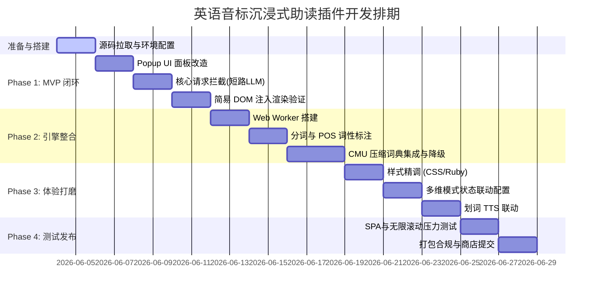

# 英语音标沉浸式助读插件开发计划 (Development Plan)

本项目基于开源翻译插件 [Read Frog](https://github.com/mengxi-ream/read-frog) 进行二次开发。为了小步快跑、尽早获得反馈，开发计划被分为 4 个核心阶段，总体工期约为 **3 到 4 周**（假设单人半脱产/业余开发时间，折合实际开发工作量约为 **10-15 人天**）。

---

## 📅 阶段任务分解与排期

---

## 详述各阶段执行清单与关键点 (Task Details)

### 📌 阶段零：准备与搭建 (预计 2 天)
* [ ] **1. 仓库克隆与依赖安装**：
  * 克隆 Read Frog 官方仓库或初始化 Git 仓库。
  * 安装 Node.js 22+ 及 `pnpm` 包管理器。
  * 运行 `pnpm install` 安装全部依赖，配置 WXT 本地环境。
* [ ] **2. 跑通基础构建逻辑**：
  * 运行 `pnpm run dev` 启动开发模式。
  * 在 Chrome 开发者模式中载入 `.wxt/chrome` 临时扩展，确保能够正常加载 Popup 界面。

### 📌 第一阶段：MVP 极速构建与验证 (预计 5 天)
*此阶段目标是实现无网络依赖的静态盲替换，打通前端 UI 到 DOM 的最小闭环。*

* [ ] **3. UI 面板轻量改造 (Popup UI)**：
  * 修改 Popup 界面组件，在原有的“翻译 (Translate)”按钮旁并排增加“音标 (IPA)”按钮。
  * 在底部增加一个开关：`[x] 翻译同时显示音标`。
* [ ] **4. 拦截网络请求 (拦截 LLM 链路)**：
  * 深入 Read Frog 核心逻辑，定位其向 Vercel AI SDK 或翻译 API 触发请求的代码段。
  * 编写拦截 Hook：当用户点击“音标”时，**拦截**远程网络请求，直接将英文原文段落重定向至本地的 Mock 音标转换处理器。
* [ ] **5. Mock 本地音标字典与 DOM 回注**：
  * 编写一个临时且极简的哈希词典（如仅包含 50 个高频词：`{ "the": "/ðə/", "developer": "/dɪˈvɛləpər/" }`）。
  * 修改 Content Script 的 DOM 回注逻辑，用 `<read-frog-phonetic class="rf-ipa">` 包裹匹配单词，将音标以纯文本形式渲染在单词下方。

---

### 📌 第二阶段：核心音标引擎整合 (预计 7 天)
*此阶段为本项目的技术核心，重点解决本地解析性能与音标准确率（特别是同形异义词）。*

* [ ] **6. 搭建后台 Web Worker 解析层**：
  * 配置 WXT 引入 Web Worker，确保所有文本分词与词典检索逻辑不在主线程运行。
* [ ] **7. 集成 Intl.Segmenter 与 compromise.js**：
  * 在 Web Worker 中使用原生的 `Intl.Segmenter` 对长文本段落进行高效分词 (Tokenization)。
  * 引入轻量级 NLP 库 `compromise.js`，对句子进行词性标注 (POS Tagging)，提取每个英文单词在上下文中的词性标签。
* [ ] **8. 集成压缩版 CMU 词典**：
  * 获取开源 CMU 词典，编写脚本精简多余音素信息。
  * 将其压缩为 `cmu_dictionary.json`（体积控制在 1.5MB 以内），并以 Trie 树或 Binary Search 哈希结构载入 Worker 内存。
* [ ] **9. 编写词尾派生 fallback 逻辑**：
  * 针对没在词典命中的词汇，编写剥离 `-s`, `-es`, `-ed`, `-ing`, `-ly` 后查找词根的匹配算法，并根据语法规则组装对应的词尾音素（如过去式转化音 /t/, /d/, /ɪd/）。

---

### 📌 第三阶段：体验与细节打磨 (预计 6 天)
*此阶段侧重于视觉体验的打磨与功能的完整度。*

* [ ] **10. 极致 CSS 与排版微调 (CSS / HTML5 Ruby)**：
  * 适配 HTML5 `<ruby>` 与 `<rt>` 标签，确保音标能优雅地对齐在英文单词上方而不导致网页行高发生难看的跳动。
  * 调试透明度（如使用淡灰色 `opacity: 0.6`）、字号（`font-size: 0.75em`），使其处于“退居二线但清晰可辨”的状态。
* [ ] **11. 配置项状态同步与持久化**：
  * 打通 Popup 与 Background Script 的 WXT Storage 数据传输。
  * 实现【仅音标】、【仅翻译】、【原文+翻译+音标】三种排版模式的完美平滑切换与页面重新渲染逻辑。
* [ ] **12. TTS 发音提取联动**：
  * 改造划词悬浮栏（Selection Toolbar）的 TTS 播放。
  * 当用户在含有音标的 DOM 上点击“发音”时，智能剥离 `<rt>` 标签（音标字符），将干净的英文文本传递给原生的 Edge TTS API。

---

### 📌 第四阶段：测试、压力测试与商店发布 (预计 4 天)
*此阶段保障在各种动态单页应用下的稳定性与性能。*

* [ ] **13. SPA 与 Mutation 压力测试**：
  * 在 Twitter (X)、GitHub、Reddit 等具有无限滚动、动态加载内容的页面上运行插件。
  * 测试 `MutationObserver` 增量抓取与注音对 CPU 的消耗，确保长时间浏览不产生内存泄露。
  * 排除测试：在 Gmail、Notion 等富文本编辑器页面，确保注音元素不会污染用户的输入内容。
* [ ] **14. 开源合规与发布**：
  * 编写 `LICENSE` 文件（基于 Read Frog 的 GPL-3.0 协议要求）。
  * 准备应用商店所需的双语宣传截图、Logo 与多语言描述。
  * 打包扩展包，提交至 Chrome Web Store 与 Edge Add-ons 商店审核。
