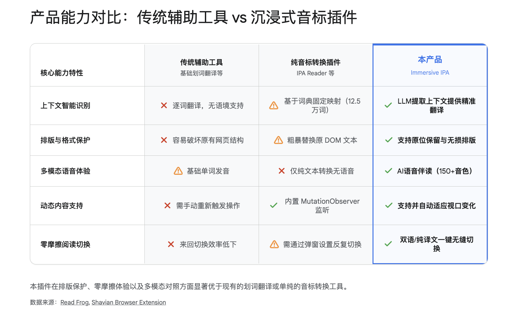
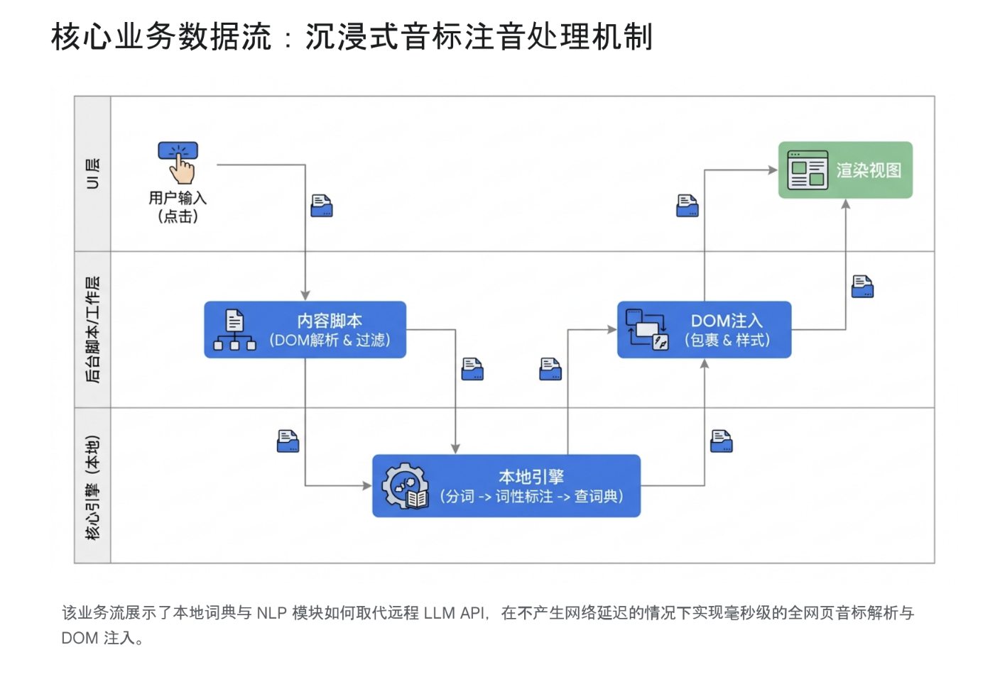

# **英语音标沉浸式助读插件：基于 Read Frog 架构的二次开发与深度产品需求分析报告**

在全球化数字办公与碎片化学习日益普及的今天，语言习得工具的形态正在发生深刻的演变。对于广大母语为中文的英语学习者而言，普遍存在一种被称为“哑巴英语”的结构性认知不对称现象：即用户往往具备极高的书面词汇量与阅读理解能力，但在口语表达与实时语音映射上存在显著的认知断层。现有的浏览器辅助工具（如各类划词翻译、沉浸式网页翻译等）极大地降低了外文信息的获取门槛，解决了“看懂”的诉求。然而，对于需要在静音办公环境下、希望通过潜移默化的阅读来提升发音准确性的进阶学习者来说，市场上依然存在巨大的产品空白。  
本报告针对“英语音标沉浸式助读插件”的开发构想，进行详尽的产品与技术需求分析。该构想建立在充分利用开源工具的理念之上，计划以广受好评的开源沉浸式翻译项目 Read Frog 1 为底层架构进行二次开发。核心目标在于，将网页原有的“双语对照（原文+译文）”范式，低成本且高效地扩展为“原文+音标”或“原文+译文+音标”的多维对照模式，从而在用户的日常高频网页浏览中无缝注入国际音标（IPA, International Phonetic Alphabet），打造一款零摩擦的隐性口语训练工具。

## **产品概述与宏观定位**

语言学习的核心在于高频次、低阻力的上下文暴露。本产品被定位为一款基于浏览器扩展（Chrome Extension）的轻量级语言辅助训练工具，旨在通过修改和增强网页的文档对象模型（DOM），为英文文本动态注入音标注音。其核心功能并非替代传统的词典或系统的发音课程，而是作为一种“辅助训练轮”，在用户进行专业阅读、新闻浏览或查阅技术文档时，提供实时的发音视觉反馈。  
在技术架构与产品演进路线上，本产品选择站在巨人的肩膀上。开源项目 Read Frog 已经实现了极其稳定的网页文本提取、复杂 DOM 树结构的排版保护、以及跨平台的浏览器扩展构建流程 1。通过复用该项目的核心框架，本产品将原有调用大语言模型（LLM）进行机器翻译的逻辑分支，改造或并行引入一套本地化的音标映射引擎。这种策略不仅能够将开发周期压缩至极致，还能继承 Read Frog 原有的诸多优秀特性，如悬浮快捷工具栏、快捷键支持、以及基于 Edge 的文本转语音（TTS）集成 1。  
目标用户群体被精确锁定为需要大量阅读英文网页、具备基础音标拼读能力、且渴望在无音频环境下提升口语肌肉记忆的职场人士与终身学习者。通过在原有的翻译操作流中平滑地植入音标对照选项，本产品旨在打破“阅读”与“口语”之间的技能壁垒，将每一次网页浏览都转化为一次低认知的发音练习。

## **用户需求与使用场景深度剖析**

要准确定义产品的功能边界，必须深入探究目标用户在特定物理与心理环境下的真实诉求。语言工具的成败往往不取决于其技术的复杂性，而在于其对用户“心流（Flow）”的保护程度。

### **目标用户群体画像及行为特征**

本产品的受众群体虽然属于语言学习者的大类，但其行为模式与传统的背词软件用户截然不同。通过对在线学习行为的分析，我们可以将核心目标用户划分为三个具有递进关系的群体，并针对其特征进行深度的需求拆解。

| 用户群体分类 | 画像特征与行为模式 | 核心痛点与产品诉求 |
| :---- | :---- | :---- |
| **职场进阶人士（核心盘）** | 在外企、跨国贸易或 IT 技术领域工作，日常需要查阅大量英文原版资料（如 GitHub、StackOverflow、行业分析报告）。英语书面能力强，但口语表达滞后。 | 办公环境通常为开放式或静音要求，不便佩戴耳机或外放语音。遇到生僻专业词汇无法准确发音。极度需要“默读+视觉音标对照”的暗中学习机制。 |
| **学术研究与备考学生（增长盘）** | 备考雅思、托福或 GRE 的高校学生，以及需要长期精读英文文献的研究员。对词汇的精准发音有强烈的应试和学术交流需求。 | 传统的查词动作（复制单词 \-\> 打开词典 \-\> 查看音标）频繁打断阅读心流，导致文献阅读效率低下。需要全篇或段落级的批量沉浸式注音。 |
| **语言爱好者与终身学习者（长尾盘）** | 习惯通过阅读《纽约时报》、《经济学人》或英文原版小说来保持语言敏感度。追求自然习得和无压力的沉浸式体验。 | 常年积累了一些错误的顽固发音习惯。希望在消费日常内容的同时，通过潜移默化的视觉提示，顺便纠正错误的元音或辅音发音。 |

### **核心使用场景推演**

产品的功能设计必须基于真实世界的使用场景。在构想本插件时，以下三种典型的交互场景构成了产品设计的核心基准：  
第一种典型场景发生在静音办公环境下的“零摩擦”发音学习。假设一名软件工程师正在阅读一篇包含大量晦涩技术术语的英文官方文档。受限于办公室环境，他无法随时点击发音按钮聆听单词读音。若使用传统的词典插件，他需要不断地进行划词、等待弹窗、查看音标，这一系列动作严重割裂了对技术文档连贯逻辑的理解。在本产品的场景中，用户只需点击侧边栏的“注音”按钮，整篇技术文档的英文单词下方或后方瞬间浮现浅色的 IPA 音标。工程师的视线在扫过英文代码说明的同时，余光能够捕捉到音标，在脑海中完成一次静默的准确拼读。信息的摄取与发音的映射在同一视区内同步完成，实现了真正意义上的沉浸式学习。  
第二种场景涉及专业词汇与同形异义词（Homographs）的即时解码。英语中存在大量拼写完全相同，但由于词性不同而导致重音和音素截然不同的词汇。例如，当用户在阅读中遇到 "He will record the new record" 这句话时，如果仅仅依赖简单的字典替换，系统可能会给出相同的音标。这就要求产品在底层具备基础的自然语言处理（NLP）能力，通过上下文词性标注（POS Tagging）准确识别第一个 "record" 为动词（/rɪˈkɔːrd/），第二个 "record" 为名词（/ˈrɛkərd/）3。这种基于语境的智能注音，是建立用户对产品信任度的关键场景。  
第三种场景则是兼顾内容深度理解与语言技能训练的三维对照阅读。在阅读复杂的长篇评论或文学作品时，即便是高水平学习者也会面临双重挑战：既要理解生僻单词的深层含义，又要掌握其发音。通过勾选产品设计的“原文+译文+音标”复合模式，用户可以首先通过母语译文快速掌握宏观句意与逻辑，随后利用原文与音标的对照，逐字攻克发音盲区。这种多模态的信息展示，将传统单一的阅读行为升维成了综合的语言吸收过程。

通过上述场景的推演可以看出，现有的发音辅助工具之所以无法满足用户的深层需求，根本原因在于它们忽视了阅读过程中的“心流保护”。传统的交互范式要求用户主动发起查询（如划词、双击），这种中断式的机制本身就是反沉浸的。而本产品的核心理念，是将发音指导化作网页的内建属性，将被动的“查询”转化为主动的“展示”，从而彻底消除语言学习过程中的摩擦力。

## **详细功能需求与技术实现路径**

基于对目标用户和使用场景的深刻理解，本节将对该插件的功能需求进行详细的解构。鉴于产品的开发策略是复用开源项目 Read Frog 的成熟代码库 1，我们需要明确哪些模块可以直接继承，哪些模块需要进行深度改造或从零开发。整体功能框架分为交互界面层（UI）、核心注音引擎层（Phonetic Engine）、以及底层 DOM 操作层。

### **交互界面与操作逻辑改造**

Read Frog 已经具备了极高水准的用户交互界面，包括悬浮动作按钮、右键菜单集成、以及可通过快捷键唤醒的设置面板 2。在二次开发中，我们不需要颠覆其视觉语言，而是要以侵入性最小的方式扩展其操作逻辑，以契合“音标对照”这一新增诉求。  
在控制面板的核心操作区，用户目前的请求是添加一个专门的“Phonetic”功能按钮。在具体的实现逻辑上，我们需要修改扩展的弹出式菜单（Popup UI）和悬浮球组件。在原有的“Translate”（翻译）按钮旁，并列新增一个“Show IPA”（显示音标）按钮。更重要的是，针对用户提出的“根据需要选择译文或音标练习”的灵活性诉求，我们需要在底层状态管理中引入一个三元复合选择机制。  
具体而言，我们将在设置选项中暴露一组复选框（Checkboxes）或下拉菜单，允许用户组合以下显示模式： 其一为“原生双语模式”，这是保留 Read Frog 原汁原味的英文原文加中文译文的展示形式。其二为全新的“纯音标对照模式”，当用户点击注音操作时，系统不调用任何翻译服务，仅在英文段落下方紧贴展示对应的 IPA 音标序列。这种模式极其适合单纯以口语肌肉记忆为目的的阅读场景。其三为最具挑战性的“三维对照模式（原文+译文+音标）”。在这种模式下，数据流变得更为复杂：系统需要同时触发两个异步操作流，一方面调用翻译服务获取句意，另一方面调用本地引擎获取音标，最后在前端进行高精度的 DOM 组装，将三者按层级有序地渲染在用户的屏幕上 1。这种灵活的组合配置，最大程度地赋予了用户掌控学习节奏的权利。

### **核心注音引擎的选型与架构设计**

注音引擎是该产品的灵魂模块，其技术选型直接决定了产品的响应速度、运行成本以及最终的商业可行性。在原版 Read Frog 的架构中，翻译的核心驱动力是调用外部的 Vercel AI SDK 和大语言模型（如 OpenAI, DeepSeek, Google Gemini 等）1。然而，将 LLM 用于实时的全网页音标转换，在工程实践上存在不可逾越的障碍。  
首先，大语言模型的推理延迟（Latency）极高。即便采用 Read Frog 中优秀的段落打包（Batch Requests）和流式输出（Streaming）技术 1，生成一篇长文的音标仍然需要数秒至十几秒的时间，这与用户期望的“即点即显”的顺滑体验背道而驰。其次，音标转换具有极高的频率，如果每次转换都消耗 LLM 的 API Token，将会产生极其高昂的运营成本，这违背了产品旨在打造一款普惠性免费工具的初衷。此外，LLM 的输出具有不可预测性，有时会自作主张地添加解释性文本或使用不规范的音标符号，这将导致后续的 DOM 注入逻辑频繁崩溃。  
因此，放弃云端 LLM，转向纯本地的客户端 JavaScript 引擎架构，是实现该功能的唯一正确路径。通过对开源社区类似项目的广泛调研，如 eng-to-ipa 的 Python 版本 6 以及 shavian-transliterate-browser-extension（一款将英文转换为萧伯纳字母及 IPA 的现代浏览器插件）3，我们构建出了一套高效的本地音标解析架构方案。  
该引擎的核心处理流程将完全在浏览器的后台工作线程（Web Worker）或扩展的 Service Worker 中执行，确保不阻塞网页的主渲染线程。引擎的输入为经过前端提取的纯净英文 HTML 文本段落。  
第一步，引擎需要进行高精度的分词处理（Tokenization）。我们计划直接调用现代浏览器内置的 Intl.Segmenter API。这是一种原生的、高性能的国际化文本分割工具，能够精准地识别单词的边界，将连续的字符串剥离出标点符号与独立单词，这比使用复杂的正则表达式更为稳健和高效 3。  
第二步，引入词性标注（POS Tagging）以解决前文提及的同形异义词陷阱。我们将打包一个如 compromise.js 的极轻量级自然语言处理库进入扩展程序 3。该库能够在毫秒级别对句子进行句法树分析，标注出每个单词在当前语境下的确切词性（名词、动词、形容词等）。  
第三步，则是最为关键的词典映射（Dictionary Lookup）。产品安装包内将捆绑一个经过高度压缩的 JSON 格式 CMU 发音词典（CMU Pronouncing Dictionary）。该词典收录了超过 125,000 个常见英语单词及其对应的国际音标（IPA）3。引擎将结合词性标注的结果，在词典中进行常数时间复杂度（O(1)）的哈希查找。对于存在变体的单词（如复数形式 \-s 或过去式 \-ed），若词典未能直接命中，引擎将执行一套降级规则（Fallback Rules），剥离词缀后查找词根并发音组装。  
通过上述纯本地的“分词-词性标注-查表”三步曲，系统可以在几毫秒内完成数千字的音标映射，且无需任何网络请求，实现了真正的零成本与极致流畅。输出的结果将是一个与原文单词序列严格对应的 IPA 字符串数组，等待后续的 DOM 渲染。

### **DOM 操作与页面排版保护机制**

将生成的音标无缝且美观地注入回原始网页，是该插件在前端工程上的最大挑战。现代网页通常是由 React、Vue 等前端框架生成的虚拟 DOM，结构极其复杂，且充斥着动态加载的脚本与内联样式。如果采用粗暴的文本替换手段，极易破坏原有页面的事件绑定与布局框架，导致页面功能失效。  
为了实现排版的绝对保护，本产品将深度继承并扩展 Read Frog 在 DOM 操作上的优秀基因。在提取文本阶段，系统会执行严格的白名单与黑名单过滤策略。具体而言，程序将遍历整个 DOM 树，但会主动避开并跳过特定标签内的内容。例如，所有的代码块（\<code\>, \<pre\>）、用户输入框（\<input\>, \<textarea\>）、以及复杂的嵌入式内容（\<iframe\>, \<svg\>）将被彻底排除在注音处理之外 3。这种精准的过滤机制，确保了技术文档中的代码片段不会被荒谬地转化为音标。  
在回注阶段（DOM Injection），系统不会改变原文所在的 DOM 节点层级，而是采用包裹（Wrapping）和并行插入的策略。具体的实现思路是，将原始的文本节点替换为一个自定义的 HTML 元素包裹器（例如 \<read-frog-phonetic class="rf-ipa-container"\>）。在这个包裹器内部，原文部分被赋予一个专用的 class，而新生成的音标文本则作为其相邻的子节点或伪元素进行插入。  
配合精心设计的 CSS 样式表，音标将以一种“退居二线”的视觉层级呈现。我们建议采用较小的字号、偏淡的灰色（如 \#888888），并使用清晰的无衬线字体（Sans-serif）进行渲染。用户可以在设置中选择音标是显示在原文单词的正上方（类似日语的 Ruby 注音形式）、紧随单词之后，还是在整个段落的下方统一换行显示 2。这种解耦的 DOM 结构，不仅保证了页面原有样式的稳定，还允许用户随时通过快捷键开关音标层的显示与隐藏。

### **辅助学习功能的横向拓展**

虽然产品的核心目标是视觉音标对照，但为了打造完整的口语学习闭环，我们必须将视觉输入与听觉验证有机结合。Read Frog 原生集成了极其强大的文本转语音（TTS）功能，它利用了免费的 Edge TTS 接口，支持多达 150 种高质量的 AI 语音和语速的无级调节 1。  
在本产品的二次开发中，我们应当将 TTS 功能与音标注音进行深度联动。当用户在阅读过程中对某个复杂的词汇或长句的音标拼读感到不确信时，可以通过简单的鼠标划词选中该区域。此时，基于 Read Frog 原有的选中悬浮工具栏（Selection Translation Toolbar）将自动弹出 1。工具栏不仅提供翻译和释义，还会高亮显示一个“发音”按钮。用户点击后，后台引擎会智能地提取原文文本（而非 IPA 符号本身），通过 TTS 引擎播放出纯正的美式或英式发音。这种“视觉认知音标 \-\> 听觉验证发音 \-\> 默读肌肉记忆”的闭环设计，极大地提升了口语练习的有效性。  
此外，基于该架构的延展性，未来还可以规划诸如“高亮生词本”等长期学习管理功能。当用户反复查询某一单词的音标时，系统可将其自动归档至本地的 SQLite 数据库或通过 Google Drive 同步的云端生词本中 5，并支持导出为标准格式供 Anki 等外部间隔重复软件使用，从而将碎片化的网页阅读转化为系统化的词汇积累。

## **关键业务流程的系统级梳理**

为了将上述碎片化的需求转化为可执行的技术蓝图，本节将详细梳理用户从触发操作到页面呈现的完整底层业务数据流。这一流程的清晰度，直接关系到开发阶段的任务分解与性能瓶颈的提前规避。  
**应用场景基准设定**：用户正在使用 Chrome 浏览器阅读一篇《连线》（Wired）杂志的深度长文。文章中包含大量复杂的科技词汇与复合句。用户希望在不打断阅读节奏的前提下，对全文进行隐式的发音练习。于是，用户点击了浏览器侧边栏扩展面板中的“原文+音标对照”悬浮按钮。

1. **事件侦听与初始化鉴权**： 整个流程始于用户在交互界面（UI Layer）的点击动作。该操作触发了一个明确的 TRANSLATE\_PHONETIC 指令信号。驻留在当前网页的 Content Script（内容脚本）接收到该信号后被立即唤醒。脚本首先调用内置的语言检测模块，通过分析页面的 HTML lang 属性及文本特征，确认当前页面的主要语言环境为英语，从而满足执行音标转换的前提条件 2。  
2. **深度 DOM 遍历与安全提取（DOM Traversal & Extraction）**：  
   确认环境后，内容脚本启动对当前可视区域（Viewport）及缓冲区的 DOM 树遍历。在此过程中，执行极其严格的节点过滤策略。系统通过预设的黑名单选择器，自动跳过导航栏、页脚版权声明、侧边栏广告等非核心阅读区域的碎片化文本。更为关键的是，如前文所述，所有的 \<script\>, \<style\>, \<code\> 及 \<input\> 元素将被彻底忽略。只有位于合法阅读区域内（如 \<p\>, \<h1\>, \<span\>）的纯文本节点（Text Nodes）才会被安全地提取出来，暂存于内存数组中准备处理。  
3. **文本切割与高并发排队（Segmentation & Queuing）**： 由于提取出的大段文本可能长达数千字符，直接整体处理会导致主线程卡顿。系统采用类似于 Read Frog 处理 TTS 时的智能断句逻辑（Sentence-aware chunking），基于标点符号和自然语言边界，将长文本切分为较小的、符合语意单元的数据块（Chunks）1。由于我们采用了纯本地的转换引擎，不存在调用外部大语言模型时需要为了节省 API 费用而进行的批量请求打包（Batch Requesting）过程。相反，这些数据块被迅速送入后台非阻塞的 Web Worker 线程池中，准备进行高速的并行处理。  
4. **本地引擎的智能注音转换（Transliteration Engine Processing）**：  
   这是整个系统中最具技术含量的一环。假设输入的数据块为一句话："The agile developer decided to record a new record."  
   * 首先，Intl.Segmenter 将其精准切分为独立的单词词元（Tokens），剔除末尾句号。  
   * 接着，数据流入 compromise.js 驱动的自然语言处理（NLP）模块。通过对句法结构的瞬间解析，系统判断出第一个 "record" 为句子谓语（动词），第二个 "record" 为宾语（名词）。  
   * 随后，系统携带这些带有词性标签的词元，向内存中常驻的 125,000+ 词条的 CMU 词典进行哈希映射查询。动词 "record" 命中 /rɪˈkɔːrd/，名词 "record" 命中 /ˈrɛkərd/。  
   * 最终，引擎将所有的 IPA 音素字符串组装，并与原句的词元保持严格的一一对应关系，形成结构化的输出负载（Payload）返回给内容脚本。  
5. **无损 DOM 组装与样式回注（DOM Injection & Styling）**：  
   内容脚本接收到包含音标的结构化数据后，开始执行精密的 DOM 逆向操作。它定位到步骤 2 中提取的原始文本节点，将其剥离，并替换为一个新构建的文档片段（DocumentFragment）。这个片段包含了预先定义好的 HTML 结构，例如使用 \<ruby\> 和 \<rt\> 标签，或者并排的 \<span\> 元素，将原文与其对应的音标包裹在一起。  
   同时，系统通过动态注入预设的 CSS 类名（Class Names），控制音标的颜色、透明度、字号及绝对/相对定位，确保新生成的音标元素在页面上呈现出一种柔和、不突兀的视觉效果。  
6. **状态驻留与动态内容监控（State Persistance & Mutation Observation）**： 随着页面的重绘完成，音标平滑且瞬间地呈现在用户眼前。与此同时，Background Script（后台脚本）在本地记录了当前的“激活状态”。为了应对现代网页中无限滚动（Infinite Scroll）或通过 Ajax 动态加载的新评论和新段落，内容脚本中隐蔽运行的 MutationObserver 模块持续监听 DOM 树的变化。一旦检测到新的合法语言内容被插入页面，系统将自动对增量文本执行步骤 2 至 5，确保用户在向下滚动的阅读过程中，音标的注音体验始终保持连贯与一致 3。

通过对上述六大步骤的严密拆解，我们可以清晰地看到，这套架构的最大优势在于彻底剥离了对高延迟、高成本的外部大模型 API 的依赖。它利用现代浏览器日益强大的本地计算能力，以一种极其优雅和极客的方式，实现了对海量网页文本的瞬间音标“渲染”，为产品的商业化落地与规模化扩张扫清了技术障碍。

## **研发周期与项目管理路径规划**

鉴于本项目明确采取“站在巨人肩膀上”的研发策略，直接在开源项目 Read Frog 的基础上进行二次分叉（Fork）与深度定制，这为我们在项目启动阶段节省了极其可观的时间成本。我们无需再重新搭建基于 WXT（一个现代化的浏览器扩展开发框架）的底层脚手架 7，也无需从头处理错综复杂的跨浏览器兼容性问题（Chrome, Edge, Firefox 的 API 差异）2，甚至连配置界面的多端同步（Google Drive Sync）和基础的划词取词功能都能直接开箱即用 1。我们的工程团队能够将几乎 100% 的精力聚焦于核心业务逻辑：即“本地音标引擎的集成”与“UI 的多维模式适配”。  
为确保项目以最优的资源配置稳步推进，建议采用敏捷开发（Agile Development）方法论。结合 Read Frog 当前采用的 TypeScript 技术栈和工程结构 1，我们将整个开发周期科学地划分为三个界限分明的冲刺阶段（Sprints），总计耗时约 3 至 4 周。

### **第一阶段：MVP（最小可行性产品）极速构建验证（预计耗时 1 周）**

这一阶段的核心目标是技术探路，跑通从 UI 点击到本地词典再到 DOM 渲染的最小闭环，验证本地解析策略的绝对可行性。 首先，开发团队需要拉取 Read Frog 的最新源码仓库。配置基于 pnpm 包管理器和 Node.js（推荐使用版本 22.0 及以上以确保兼容性）的本地开发与构建环境 8。确保能够成功执行构建命令，生成并加载 Chrome 的本地未打包测试扩展。 随后进入核心代码的侵入式改造。在 UI 层面，开发者需要修改基于 React/Vue/Solid 构建的 Popup 面板源码，在原有的“翻译”操作区硬编码植入一个“IPA 音标”测试按钮 4。在引擎层面，暂时绕过复杂的 NLP 词性标注逻辑，直接引入一个轻量级的、静态的纯 JSON 格式英文至 IPA 映射表。开发团队需在代码中拦截 Read Frog 原本向 Vercel AI SDK 或远程翻译 Provider 发送请求的函数调用链路 1，利用钩子（Hooks）将其“短路（Short-circuit）”，并重定向至新编写的本地词典查找模块。最后，改造原始的 DOM 注入器，将本地引擎返回的简易音标字符串，按照系统原有的双语排版逻辑强行渲染回网页。本阶段的验收标准是：在任意结构的英文维基百科或新闻页面上，点击按钮后能瞬间呈现全篇盲匹配的基础音标，且不导致页面布局的灾难性崩溃。

### **第二阶段：引擎深度整合与极致体验打磨（预计耗时 1.5 周）**

当基础设施搭建完毕，第二阶段的任务是解决核心痛点，将一个“能用”的原型升级为一个“好用”的生产级产品。 工程的重中之重是解决同形异义词和复杂语境发音问题。开发人员需将原生的 Intl.Segmenter API 和 compromise.js（或类似的轻量 NLP 库）深度集成进扩展的后台处理流水线中 3。编写一套健壮的形态学分析逻辑（Morphological Analysis），确保系统能够根据上下文的词性标签（如动词、名词、形容词的复数或过去式形态），精准匹配和推导音标。 在前端表现层，UI 的打磨需细致入微。需新开辟专门的 CSS 样式文件和类作用域，精确控制音标的排版间距、色彩透明度和字体字号，使其在视觉上达成“退居二线但不缺失”的微妙平衡。同时，在设置面板中完成【仅音标】、【仅翻译】、【原文+音标】、【原文+翻译+音标】等一系列复选框配置项的完整联动及本地状态持久化逻辑 2。 此外，必须打通辅助学习的闭环。确保划词悬浮工具栏在捕获到包含音标的 DOM 结构时，其内置的发音引擎能智能剔除 IPA 符号文本，正确调用内置的 Edge TTS 接口朗读出纯正清晰的英文原声 1。本阶段的里程碑要求：系统在处理《经济学人》等复杂长文时，音标注音准确率达到 95% 以上，各种对照模式的切换行云流水，UI 交互自然且无跳跃感。

### **第三阶段：全场景压力测试、封装与发布上线（预计耗时 0.5 周）**

项目进入收尾阶段，质量保证（QA）成为核心。测试团队需要在各种极端的网页环境下进行压力测试，特别是针对基于 React/Vue 构建的复杂单页应用程序（SPA），以及诸如 Twitter（X）、Reddit 等含有大量动态异步加载（Ajax）瀑布流内容的平台，重点考验底层 MutationObserver 监听器的内存稳定性和排版抗干扰能力 3。同时还要在各类富文本编辑器场景中进行排除测试，确保注音代码绝不污染用户的输入内容。 一切验证无误后，进入合规与打包流程。由于本项目基于 Read Frog 进行二次开发，团队必须严格遵守其原本声明的 GPL-3.0 开源协议 1，确保衍生的修改代码同样对社区开放。最后，准备多语言版本的应用商店宣传图文，撰写精准的产品描述 9，申请并提交至 Chrome Web Store 和 Edge Add-ons 商店进行官方审核。本阶段标志着产品正式走向市场，开始接受第一批种子用户的真实检验。

| 冲刺阶段 | 核心开发任务 | 预计周期 | 关键交付里程碑 |
| :---- | :---- | :---- | :---- |
| **Phase 1: MVP 验证** | 环境搭建与依赖安装；修改 UI 注入测试按钮；集成静态词典；短路 LLM 请求并接管 DOM 渲染。 | 1.0 周 | 实现无后端依赖的静态全文基础音标盲匹配替换。 |
| **Phase 2: 引擎升级** | 引入 Intl.Segmenter 与 NLP 库；处理同形异义词与词缀变形；重构 CSS 样式；实现多维组合模式切换；完善 TTS 提取逻辑。 | 1.5 周 | 智能上下文注音准确率达标；多维排版模式平滑可用。 |
| **Phase 3: 测试发布** | SPA 与无限滚动页面的 Mutation 压测；排查富文本编辑器污染；撰写多语言宣发材料；遵守 GPL-3.0 协议打包提交商店。 | 0.5 周 | 产品在主流浏览器商店上架，建立初始用户反馈通道。 |

## **商业变现模型与可持续发展战略**

在一个成熟的互联网工具产品生命周期中，优秀的技术只是入场券，找到与之匹配的商业模式才是保持项目持续迭代和长远发展的动力之源。由于本产品在架构初期采用了开源策略，且底层技术逻辑大量复用了以“教育平权”为愿景的开源社区成果 10，因而在商业化的起步阶段必须保持足够的克制。但这并不意味着项目缺乏商业想象力，恰恰相反，在庞大的语言学习市场中，高频且刚需的工具具有极强的变现弹性。以下是几种层层递进的可行商业模式探讨：  
首先，在项目的引入期和成长期，应坚定不移地走**完全免费的公益与开源路径（Open Source & Free-to-Use Core）**。这并非是放弃盈利，而是深谋远虑的获客战略。正如 Read Frog 的发展历程所示，由于我们将核心的音标解析引擎完全下放至浏览器本地运行，不消耗任何服务器的 CPU 算力和网络带宽资源，这就从根本上抹平了为海量用户提供基础服务所产生的边际成本。因此，承诺将核心的“全文网页音标对照”功能永久免费提供给大众，是迅速撕开市场裂口、在各大技术论坛（如 V2EX、Reddit、GitHub）积累极速口碑和获取大量种子用户的最佳“Growth Hacking”手段 1。在这一阶段，单人开发者或小型团队可以通过在项目官网和 GitHub 仓库醒目位置悬挂 Buy Me a Coffee、Patreon 的链接，或者国内常见的微信、支付宝赞助二维码，以接受用户自愿的打赏（Donation）。这种方式虽然收入不可预测，但在早期往往能带来最直接的经济正反馈。  
当用户基数达到一定规模（如日活达到数万量级）后，产品即可自然过渡到高级辅助功能的付费解锁（Freemium / Subscription Model）模式。这里的核心逻辑是：基础的发音对照（温饱需求）免费，深度的个性化口语提升（进阶需求）收费。我们可以推出每月 2 至 5 美元的轻量级订阅服务（Premium Plus）。收费点绝不可设置在本地音标解析上，而应集中在需要消耗服务器云端算力的高阶服务上。例如，基础版用户使用免费的浏览器原生或 Edge TTS，而付费用户则可以解锁接入 Azure AI 语音、ElevenLabs 等顶级且具有丰富情感合成和克隆音色的拟真 TTS API 服务 1。其次，高级版可以解锁跨设备、多端同步的云端智能“生词本”。系统自动记录用户在阅读中反复高亮查阅音标的难点词汇，将其上传至云端数据库 5，并结合艾宾浩斯记忆曲线提供类似 Anki 的主动复习推送服务，这对于重度语言学习者而言具有极高的付费意愿。另外，还可以提供由顶级大语言模型驱动的定制发音指导服务：针对特定复杂的英文原句，调用付费的 API 接口进行语音学的深度解析，标记出句子中的连读、弱读、浊化和爆破等高级发音现象，并生成一对一的纠音建议 5。  
最后，为了兼顾极客用户群体的特殊需求，产品应保留并优化原有的 **BYOK (Bring Your Own Key) 模式**。延续 Read Frog 广受赞誉的开放基因 5，如果某些专业用户希望使用诸如 GPT-4o 或 Claude 3.5 Sonnet 等顶级大语言模型来进行极其细腻的语境音标分析、甚至附带详细的发音口型讲解，产品应开放自定义 API Endpoint 的配置入口。允许用户填入自己购买的 API Key。在此模式下，产品本身作为纯粹的工具展示层，不赚取任何算力差价。这种极度透明和保护用户隐私的策略，将极大地提升高阶技术用户的防备心理底线，显著增强产品的长期用户留存率。

## **赛道前景剖析与市场发展预期**

任何一款产品的存活概率与天花板，都与其身处的市场赛道宽度及护城河的深浅息息相关。在做出最终决策前，必须以宏观的视野审视该产品的前途。  
从宏观市场潜力来看，外语教育（尤以英语为绝对主导）是一个展现出惊人韧性且永不衰退的全球万亿级赛道。尤其在东亚市场（如中国、日本、韩国等地区），受到长期应试教育体制的历史惯性影响，“重读写、轻听说”的倒挂现象极为普遍。这直接导致了数以亿计的职场人士和学生，虽然能够顺畅阅读英文行业资讯或学术论文，却在需要口语交流的场合捉襟见肘，产生深深的“哑巴英语”焦虑。用户内心潜藏着极其强烈的自我提升诉求，但残酷的现实是，繁重的日常工作与碎片化的现代生活节奏，使得绝大多数成年人根本无法坚持去参加传统的、需要大块时间投入的系统性口语培训班。  
在这样的背景下，将复杂的学习过程巧妙地“寄生”于用户每天必须进行的高频网页阅读习惯中，这种被称为微学习（Micro-learning）**和**隐性学习（Implicit Learning）的产品理念，展现出了不可阻挡的趋势吸引力。观察市场上现有的浏览器翻译增强工具，如沉浸式翻译类插件，在短短一两年内便能轻易累积数百万的下载量和极其活跃的社区生态 1，这充分证明了：基于浏览器 DOM 底层操作、提供即时上下文辅助的轻量级增强工具，具有极高的用户粘性和庞大的市场接受度。本产品正是踩在了这一巨大的流量风口之上，并敏锐地切入了一个尚未被巨头完全覆盖的细分领域——发音辅助。  
然而，在乐观的市场预估背后，必须清醒地进行竞争格局与自身隐患（SWOT）的审视。本产品所面临的最大隐患（Threats）在于其商业模式和技术实现的门槛相对较低。我们所依赖的“沉浸式 DOM 注入”和“本地词典解析”技术，虽然精巧，但并非高不可攀的核心机密。如果该产品在短时间内获得巨大的流量成功并验证了市场需求，其最大的潜在竞争对手——也就是原版的沉浸式翻译插件或其他老牌语言工具巨头（如 Google Translate 团队）——完全有能力通过一次轻量级的版本迭代，迅速将“显示音标”作为其附庸的子功能进行收编，从而形成降维打击。  
因此，产品的破局点和长期护城河绝不能仅仅建立在“多显示了一行音标”这样单薄的功能上。我们必须在“口语练习闭环”这条纵深路线上做深、做透。这意味着产品需要不断进化，从一个简单的“音标显示工具”，逐步升维成一个懂用户痛点的“私人英语发音教练”。例如，通过引入更高级的本地 NLP 算法，不仅仅展示单词的独立音标，还能智能识别并标记出句子中的连读（Liaison）现象、**弱读（Weak forms）现象以及意群停顿（Pause marking）**。同时，将高质量 TTS 听觉纠音、生词复习机制等深度融合。当产品真正具备了不可替代的教学属性与数据积淀时，才能在巨头环伺的市场中建立起坚不可摧的生态壁垒。

## **是否有必要做：最终产品决策与战略建议**

本报告最终要回答一个最为核心也是最务实的问题：对于发起这个构想的您而言，投入宝贵的时间和精力去做这款产品，究竟是抓住了一次难得的机遇，还是在做一件注定浪费时间的无用功？  
经过全方位的市场需求分析、技术路径拆解以及商业前景推演，本报告给出的终极研判结论是：**极其有必要，且具备极高的投入产出比（ROI）。然而，在具体的战略实施思路上，必须严格规避几项致命的技术误区。**  
首先，从需求端来看，它解决了一个极其精准且痛点极深、却被主流市场长期忽视的微观需求。作为一名苦于口语不佳的英语学习者，您自身在办公场景下“不便出声、只能对照音标默读”的痛点，绝非是个案，而是代表了数以千万计职场学习者的共同困境。现有市场上的产品，无论是庞大臃肿的系统翻译工具，还是粗制滥造的简易音标转换插件，都没有真正做到在保护用户阅读心流的同时，提供优美、准确的沉浸式发音指导。这片空白的市场，正等待着一款足够懂用户的产品来填补。  
其次，从执行端来看，这绝不是一个需要从零开始的庞大工程，而是一条技术路径清晰且极其成熟的捷径。借助您已经敏锐发现的开源项目 Read Frog 强大的代码基建 1，您相当于直接获得了世界级的浏览器扩展脚手架。它已经替您趟平了最令人头疼的 DOM 解析难题和跨平台兼容性雷区。结合开源社区中已经非常成熟的本地 IPA 转换库和轻量级 NLP 包 3，一个具备基础编码能力的产品经理或前端开发者，完全有把握在仅仅 2 到 3 周的业余时间里，拼装出一款可供内测的最小可行性产品（MVP）。这种极低的试错成本，对于独立开发者（Indie Hacker）而言，是一场稳赚不赔的博弈：倘若一炮而红，您将收获巨大的个人影响力和被动收入的管道；即便市场反应平平，您也将在整个开发过程中获得一次极具含金量的 TypeScript 现代扩展开发实战经验，为后续的技术生涯打下坚实基础。  
然而，为了确保这份努力不被浪费，请务必在开发过程中牢记以下几条战略实施的“防坑指南”：  
其一，在技术架构的选型上，**绝对不要迷信 AI，切勿使用大语言模型（LLM）API 去做纯粹的全篇音标转换！** 这是初期极易因为思维定势而犯下的致命架构错误。大模型虽然无所不能，但在此场景下犹如“用高射炮打蚊子”，其高昂的成本和令人难以忍受的生成延迟，会瞬间摧毁用户“即点即看”的流畅体验预期。必须坚定不移地采用前文强调的**本地词典查表 \+ 本地轻量 NLP 纠错**的底层逻辑 3。将音标生成做成一项完全本地化、甚至能在断网环境下实现毫秒级响应的特性，这不仅是为了省钱，更是您秒杀任何同类 AI 翻译插件的核心体验壁垒。  
其二，在前端的视觉呈现上，**必须保持排版的极致美学与克制**。音标的显示应当被视为一种辅助信息，绝不能喧宾夺主地干扰甚至破坏正常的英文主文本阅读。开发团队需要耗费大量的精力去打磨 CSS 样式细节，探索最佳的字体、灰度和行高比例。可以借鉴日语假名注音中优雅的 \<ruby\> 和 \<rt\> 标签形式，使得即便是在塞满音标的复杂句型中，整个网页的版面依然保持着高级感和呼吸感。  
最后，在项目推进的节奏上，建议采取**小步快跑，尽早开源**的极客精神。第一版 MVP 只需要简陋但稳定地支持最基础的“英文段落转音标”即可。不要等待功能完美，尽早上线至 Chrome 应用商店，并积极将其发布在各大技术与产品社区（如 V2EX、掘金、Product Hunt、Reddit）中。主动迎接社区的早期真实反馈，利用真实用户的声音来决定下一步是否需要优先开发“同形异义词处理”或是“连读与弱读标记”等高阶功能，从而避免陷入闭门造车的泥潭。  
综上所述，站在 Read Frog 这一优秀的开源巨人的肩膀上，顺势开发一款“英语音标沉浸式助读插件”，不仅在技术实现上走了一条极具智慧的捷径，更以极高的精准度击中了一个规模可观、急需消费升级的语言学习细分市场。这是一个极具潜力、值得您全力以赴去实现的出色独立产品构想。

#### **Works cited**

1. Read Frog \- Open Source Immersive Translate | 陪读蛙 \- 开源沉浸式翻译 · GitHub, accessed May 21, 2026, [https://github.com/mengxi-ream/read-frog](https://github.com/mengxi-ream/read-frog)  
2. Releases · mengxi-ream/read-frog \- GitHub, accessed May 21, 2026, [https://github.com/mengxi-ream/read-frog/releases](https://github.com/mengxi-ream/read-frog/releases)  
3. DeepNestedSpider/shavian-transliterate-browser-extension \- GitHub, accessed May 21, 2026, [https://github.com/DeepNestedSpider/shavian-transliterate-browser-extension](https://github.com/DeepNestedSpider/shavian-transliterate-browser-extension)  
4. Translation Toggle Logic and Content Detection | Dosu, accessed May 21, 2026, [https://app.dosu.dev/29569286-71ba-47dd-b038-c7ab1b9d0df7/documents/a5158a23-b86f-49a9-a848-8a3caff52d87](https://app.dosu.dev/29569286-71ba-47dd-b038-c7ab1b9d0df7/documents/a5158a23-b86f-49a9-a848-8a3caff52d87)  
5. Read Frog 2025: 20K Weekly Active Users & 3000+ Stars, accessed May 21, 2026, [https://www.readfrog.app/en/blog/2025-recap](https://www.readfrog.app/en/blog/2025-recap)  
6. eng-to-ipa \- PyPI, accessed May 21, 2026, [https://pypi.org/project/eng-to-ipa/](https://pypi.org/project/eng-to-ipa/)  
7. package.json \- mengxi-ream/read-frog \- GitHub, accessed May 21, 2026, [https://github.com/mengxi-ream/read-frog/blob/main/package.json](https://github.com/mengxi-ream/read-frog/blob/main/package.json)  
8. SOURCE\_CODE\_REVIEW.md \- mengxi-ream/read-frog \- GitHub, accessed May 21, 2026, [https://github.com/mengxi-ream/read-frog/blob/main/SOURCE\_CODE\_REVIEW.md](https://github.com/mengxi-ream/read-frog/blob/main/SOURCE_CODE_REVIEW.md)  
9. Read Frog \- Open Source Immersive Translate \- Microsoft Edge Add-ons, accessed May 21, 2026, [https://microsoftedge.microsoft.com/addons/detail/cbcbomlgikfbdnoaohcjfledcoklcjbo](https://microsoftedge.microsoft.com/addons/detail/cbcbomlgikfbdnoaohcjfledcoklcjbo)  
10. mengxi-ream \- GitHub, accessed May 21, 2026, [https://github.com/mengxi-ream](https://github.com/mengxi-ream)  
11. Speech Translation with Large Language Models: An Industrial Practice \- arXiv, accessed May 21, 2026, [https://arxiv.org/html/2312.13585v1](https://arxiv.org/html/2312.13585v1)